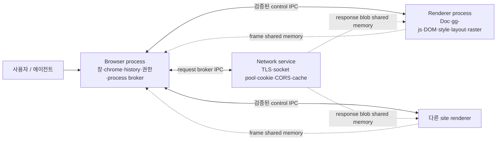
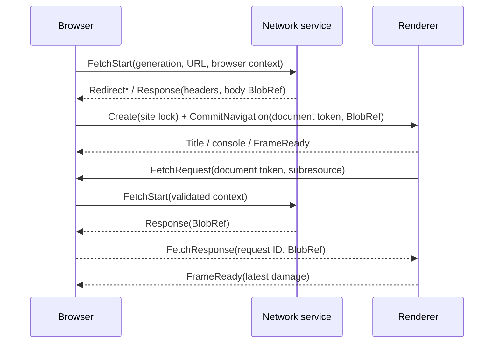

# Browser / renderer / network 프로세스 격리와 IPC 설계

기준일: 2026-07-23. 이 문서는 GG Browser의 제품 경로를 단일 프로세스에서
분리하는 구현 계약이다. 목표는 페이지 크래시·무한 실행·엔진 취약점이 브라우저
창과 프로필 비밀로 번지는 것을 막으면서, **DOM과 gg-js가 같은 renderer 안에
있다는 GG의 성능 이점**은 보존하는 것이다.

## 1. 현재 구조와 문제

현재 native shell(`browser/shell.py`)과 tkinter shell(`browser/browser.py`)은
각자 다음 상태를 한 프로세스 안에서 직접 소유한다.

- 창, 주소창, 입력, history와 탐색 취소
- Rust `ggcore.Doc`, gg-js, DOM과 CSS 상태
- Python 노드·layout tree·display list
- Rust `TextEngine`, 이미지·폰트 decode와 raster
- `browser/net.py`의 쿠키 jar, 소켓 pool, memory/disk cache

`browser/native.py::load_document()`는 Python fetch callback을 호출하면서 HTML
parse → script → style → DOM export를 한 번에 수행한다. `browser/driver.py::Page`
역시 같은 프로세스에서 `Doc`를 직접 잡는다. `NavigationController`가 메인 문서
요청을 UI thread 밖으로 옮겼지만 thread 격리일 뿐, renderer 오류와 프로필
권한은 여전히 같은 프로세스에 있다.

이 상태의 구체적인 위험은 다음과 같다.

1. parser/JS/layout/image decode의 panic·abort·메모리 손상이 창 전체를 종료한다.
2. renderer 코드가 소켓, 쿠키, cache와 로컬 파일 권한을 함께 가진다.
3. resource fetch와 live tick 일부가 UI 순서에서 동기 실행된다.
4. native/tkinter/headless 세 경로가 같은 수명주기를 중복 구현한다.
5. 한 탭의 CPU·메모리 폭주를 OS 단위로 중단하거나 계측할 수 없다.

## 2. 결정한 프로세스 모델

첫 제품 모델은 **브라우저 1개 + 프로필별 network service 1개 + 활성 top-level
문서별 renderer 1개**다. renderer는 첫 실제 문서를 commit하기 전에 scheme과
site(`scheme + eTLD+1`)에 잠기며, cross-site top-level 탐색은 새 renderer에
commit한 뒤 이전 renderer를 종료한다. iframe 구현 전에는 top-level document가
격리 단위고, iframe을 추가할 때 browsing-context group과 site instance 단위로
확장한다.



### Browser process — 신뢰 경계

- `NativeWindow`, chrome, 탭, 주소창, history/session restore 소유
- 모든 child 생성·종료·site lock·document capability 발급
- 사용자 gesture, permission, download, file picker, 외부 protocol 결정
- navigation을 승인하고 최종 URL/origin/top-level site를 계산
- renderer/network IPC를 검증하고 stale generation을 폐기
- renderer가 죽으면 crash page를 표시하고 history를 유지

브라우저는 페이지 DOM, Python layout tree, page JS 또는 쿠키 값을 소유하지
않는다. `about:home`과 브라우저 오류 페이지는 web renderer와 분리된 내부 문서로
취급한다.

### Renderer process — 불신하는 web-content 실행 영역

- `ggcore.Doc`, gg-js realm, DOM/CSS, module graph, event loop 소유
- Python node/layout/display state와 페이지 focus/hit-test 소유
- 이미지·폰트 decode 및 content viewport raster 소유
- network 요청은 capability가 붙은 IPC로만 제출
- navigation/default action은 직접 수행하지 않고 browser에 요청
- query/snapshot/evaluate를 renderer 내부에서 끝낸 뒤 작은 결과만 반환

중요한 성능 불변식은 `DOM node == gg-js native value`가 renderer 내부에서 계속
유지된다는 것이다. 프로세스 밖으로 전체 DOM export나 CDP 형태의 다단 왕복을
만들지 않는다.

### Network service — 프로필 권한 소유자

- `_COOKIE_JAR`, `_POOL`, `_CACHE`, disk cache와 TLS socket 소유
- redirect, reserved header, credentials, SameSite, mixed-content, CORS 정책 집행
- 프로필과 incognito마다 별도 process/data directory 사용
- renderer가 제시한 origin을 신뢰하지 않고 browser가 발급한 document context로
  request 권한을 재계산
- response body는 크기에 따라 inline 또는 읽기 전용 shared blob으로 전달

network service는 renderer보다 권한이 높지만 UI·DOM·file picker 권한은 없다.

## 3. 실행 순서와 thread 규칙

- Browser UI thread는 IPC 응답을 기다리며 block하지 않는다. reader thread가
  검증된 event를 bounded queue에 넣고 native loop가 frame마다 drain한다.
- Renderer main sequence 하나만 `Doc`, node tree, layout과 `TextEngine`을 만진다.
  network 응답과 input은 같은 queue에 직렬화한다.
- Network service는 bounded worker pool에서 현재 blocking HTTP 구현을 실행한다.
  cookie/cache/pool은 이 process 안에서만 공유한다.
- child가 응답하지 않아도 UI thread가 `join()`, blocking `recv()` 또는 network
  I/O를 호출해서는 안 된다.

## 4. Transport와 wire format

초기 transport는 Python `multiprocessing.connection`의 로컬 named pipe/Unix
socket을 사용하되 **`send()`/`recv()`와 pickle은 금지**한다. `send_bytes()`와
`recv_bytes()`로 UTF-8 JSON envelope만 교환한다. Browser가 256-bit 무작위
secret과 OS-user 전용 endpoint를 만들고 child가 handshake에서 이를 증명한다.

```json
{
  "v": 1,
  "type": "renderer.input",
  "msg_id": "184",
  "reply_to": null,
  "renderer_id": "r-7",
  "document_token": "128-bit-random-hex",
  "generation": 12,
  "payload": {"kind": "pointer_down", "x": 410.5, "y": 220.0}
}
```

규칙:

- protocol version, role, build hash, nonce를 `hello/hello_ack`에서 확인한다.
- control message는 기본 1 MiB, URL 16 KiB, header 합계 64 KiB로 제한한다.
- receiver는 `recv_bytes(MAX_CONTROL_BYTES)`로 allocation 전에 크기를 제한한다.
- unknown type/field, 중복 ID, 음수 크기, quota 초과는 `protocol_error` 후 sender를
  종료한다.
- 모든 request는 deadline과 cancel 가능한 `msg_id`를 가진다.
- `generation`이 현재 navigation보다 오래된 response/frame/event는 버린다.
- renderer별 in-flight control request는 64개로 제한하고 input/frame release를
  console/network progress보다 우선한다.
- console은 초당·문서당 줄 수와 총 byte를 제한한다.
- JSON은 control plane 전용이다. frame, response body, upload는 JSON/base64로
  복사하지 않는다.

추후 Rust 양쪽에 IDL/codegen이 필요해질 때 wire version을 유지한 채 binary
codec으로 바꿀 수 있다. 첫 단계부터 특정 process 배치에 묶이지 않는 message
interface를 쓰는 것은 Chromium Mojo의 message-pipe 원칙과 같은 방향이다.

## 5. Capability와 보안 context

Browser가 다음 식별자를 발급한다.

| 식별자 | 수명 | 권한 |
|---|---:|---|
| `profile_id` | browser session | cookie/cache/storage partition |
| `renderer_id` | child process | process lock과 quota |
| `site_lock` | renderer lifetime | commit 가능한 scheme/site |
| `document_token` | document commit | origin, top-level site, sandbox/credential context |
| `generation` | navigation attempt | 늦은 응답과 frame 폐기 |
| `request_id` | fetch 1회 | cancel, body stream, response 결합 |
| `file_token` | 사용자 선택 1회 | 선택된 파일 하나의 upload read |

`document_token`에 연결된 origin/site는 browser 또는 network service가 main
response의 최종 URL에서 계산한다. Renderer가 request payload에 임의 origin,
Cookie, Host, Authorization context를 넣어도 권한 계산에는 쓰지 않는다.

`file:`은 browser가 승인한 파일만 opaque `file_token`으로 접근한다. renderer에는
실제 경로나 디렉터리 권한을 넘기지 않는다. `about:`은 browser 내부에서 처리하고,
creator가 있는 `data:`/`about:blank`는 creator document context를 상속한다.

## 6. 핵심 message 계약

### Browser ↔ Renderer

| 방향 | type | 핵심 payload / 응답 |
|---|---|---|
| B→R | `renderer.create` | renderer/site lock, viewport, surface set |
| B→R | `renderer.commit_navigation` | document token, final URL, headers, body blob |
| B→R | `renderer.viewport` | CSS px, device scale, surface generation |
| B→R | `renderer.input` | pointer/key/text/wheel + user gesture ID |
| B→R | `renderer.frame_release` | browser가 present를 끝낸 surface slot |
| B→R | `renderer.tick` | monotonic delta, visibility |
| B→R | `renderer.capture_state` | history용 scroll/form/focus snapshot 요청 |
| B→R | `renderer.restore_state` | 새 문서에 검증된 state 적용 |
| B→R | `renderer.query` | query/snapshot/evaluate/action batch |
| B→R | `renderer.shutdown` | 정상 종료 deadline |
| R→B | `renderer.ready` | protocol capability, site-lock ack |
| R→B | `renderer.frame_ready` | surface/slot/frame/damage metadata |
| R→B | `renderer.title` | 길이 제한 title |
| R→B | `renderer.navigation_request` | URL/method/body/referrer + gesture ID |
| R→B | `renderer.fetch_request` | Fetch spec + document token |
| R→B | `renderer.cookie_set` | `document.cookie` setter 한 건 |
| R→B | `renderer.cursor_status` | cursor type, hover URL/status text |
| R→B | `renderer.console` | level, bounded text, source position |
| R→B | `renderer.query_result` | compact JSON 결과 또는 typed error |

`query`는 `snapshot`, `query`, `query_all`, `click`, `evaluate`를 한 요청에 batch할
수 있어야 한다. 결과 node handle은 `(document_token, ridx)`이고 다른 document에
재사용하면 거절한다.

### Browser ↔ Network

| 방향 | type | 핵심 payload / 응답 |
|---|---|---|
| B→N | `network.bind_context` | browser가 계산한 document security context |
| B→N | `network.fetch_start` | request ID, context, URL/method/header/body |
| B→N | `network.fetch_cancel` | request ID |
| B→N | `network.cookie_set` | context + setter string |
| B→N | `network.drop_context` | navigation/process 종료 |
| N→B | `network.redirect` | status, target; browser 승인 대기 |
| N→B | `network.response` | status, filtered headers, final URL, body blob |
| N→B | `network.cookie_snapshot` | HttpOnly 제외 document-cookie replica |
| N→B | `network.error` | stable error code + 제한된 diagnostic |

Fetch/CORS 응답은 browser가 해당 renderer/document에 다시 routing한다. network가
browser를 거치지 않고 renderer와 직접 pipe를 갖는 최적화는 같은 capability
검증을 유지하고 broker 병목이 실측된 뒤에만 한다.

`document.cookie` read는 동기 API이므로 renderer는 HttpOnly가 제거된 현재 문서용
replica를 갖는다. Network service가 `Set-Cookie`를 적용할 때 filtered snapshot/
delta를 push하고, setter는 `renderer.cookie_set`으로 다시 service에서 검증한다.
실제 HTTP `Cookie` header는 끝까지 network service만 조립한다.

## 7. 큰 데이터와 frame 공유

### Blob

64 KiB 이하 body만 control message에 base64로 넣을 수 있다. 그보다 크면 producer가
`BlobRef {id, shm_name, size, sha256, media_type}`를 보내고 consumer가 read-only로
map한다. 수명은 `blob_opened`/`blob_release` ACK로 관리한다.

- mapping은 browser 또는 network service만 생성한다. 불신하는 renderer가 임의
  `shm_name`을 보내 browser/network가 열게 해서는 안 된다.
- renderer가 큰 request body를 써야 할 때 browser가 먼저 writable slot capability를
  발급하고, seal ACK 뒤 network는 browser가 발급한 ID만 연다.
- profile 1개당 outstanding blob byte와 개수를 제한한다.
- declared size보다 작은 mapping, hash 불일치, 재사용된 ID는 protocol error다.
- body는 한 번 소비 후 release하며 renderer가 network cache memory를 직접 map하지
  않는다.
- upload file은 browser가 발급한 file token으로 network가 직접 stream한다.

Python shared memory에서 “read-only”는 초기에는 protocol 불변식일 뿐 OS 권한이
아니다. Producer는 handoff 뒤 해당 buffer를 신뢰하거나 재사용하지 않는다. Native
handle layer를 넣을 때 consumer mapping을 OS 수준 read-only로 낮춘다.

### Frame

Browser가 무작위 이름의 shared-memory slot 3개를 만들고 renderer에 mapping
capability를 준다. Renderer는 content viewport를 raster한 뒤 다음 metadata만
보낸다.

```text
FrameReady(surface_generation, slot, frame_id,
           width, height, stride, RGB8, damage_rects, device_scale)
```

Browser는 latest frame만 present하고 `FrameReleased`를 보낸다. resize는 새 surface
generation을 만들며 이전 slot은 모든 release/ACK 뒤 폐기한다. Renderer는 사용
중 slot을 다시 쓰지 않고, 빈 slot이 없으면 중간 frame을 합쳐 최신 damage만
유지한다.

첫 구현은 `TextEngine.render_frame_raw()` 결과를 renderer에서 shared memory로 한
번 복사한다. 프로파일 결과가 필요할 때만 Rust가 shared buffer에 직접 쓰는 API를
추가한다. Browser chrome은 browser process가 별도로 raster/composite하므로 web
content가 주소창 픽셀이나 hit target을 만들 수 없다.

## 8. Navigation, history와 lifecycle



- Browser가 provisional navigation과 history를 소유한다. Renderer가 첫 commit
  준비를 끝내기 전에는 주소창/history를 최종 commit하지 않는다.
- `HistoryEntry`는 URL, navigation state, scroll/form/focus snapshot을 저장한다.
  raw Python node 또는 `Doc` handle을 저장하지 않는다.
- 초기 back/forward는 network cache에서 문서를 다시 만들고 state를 복원한다.
  BFCache는 renderer freeze/thaw가 안정된 후 추가한다.
- cross-site 탐색은 새 renderer에 commit한 뒤 old renderer를 닫는다. 실패하면 old
  document를 유지할 수 있다.
- 동일 generation의 fetch/navigation만 document에 settle한다.

Renderer 상태는 `Starting → Handshaking → Locked → Active → Frozen → Dead`로만
전이한다. site lock은 한 번 좁혀진 뒤 renderer lifetime 동안 넓어지지 않는다.

## 9. Crash, hang와 resource policy

- IPC EOF, child exit, heartbeat deadline 초과를 서로 다른 crash reason으로 기록한다.
- Renderer crash 시 browser는 history와 URL을 유지하고 “페이지가 종료됨 / 다시
  로드” UI를 보여 준다. 자동 무한 reload는 하지 않는다.
- 정상 shutdown deadline 뒤에는 process tree를 kill한다. Browser 종료 시 Job/
  process group의 모든 child가 함께 종료되어야 한다.
- renderer별 wall time, CPU, RSS, outstanding blob, console, fetch, frame quota를
  계측한다.
- gg-js instruction fuel은 process kill보다 먼저 동작하는 1차 방어로 유지한다.
- Network crash는 service를 재시작하고 in-flight 요청을 명시적 network error로
  끝낸다. cookie 영속 저장이 도입되기 전에는 crash 시 in-memory cookie가 사라질
  수 있음을 UI/log에 표시한다.

프로세스 분리는 아직 OS sandbox가 아니다. Renderer RCE가 직접 `socket()`이나
`open()`을 호출하지 못하게 하려면 별도 단계가 필요하다.

- Windows: kill-on-close Job Object, restricted token/AppContainer, low integrity,
  network capability 없음, 전용 temp ACL, handle allowlist
- Linux: `no_new_privs`, user/mount/network namespace, seccomp allowlist, rlimit/cgroup
- Network service: profile cache 디렉터리와 outbound socket만 허용

Sandbox 전에도 browser는 renderer IPC를 완전히 불신하고 모든 capability를 다시
검증한다. Chromium 역시 process lock, browser-side IPC 정책, network response
제한과 low-privilege sandbox를 결합한다.

## 10. Headless Page와 AI-native 성능 보존

제품 기본 `Page`는 renderer client proxy가 되지만 기존 API 모양은 유지한다.

- `Page.goto/query/text/click/evaluate/snapshot`은 renderer-local command로 실행한다.
- `snapshot()`은 현재 Rust compact snapshot만 반환하고 full DOM export를 금지한다.
- 여러 read/action은 `Page.batch()` 한 왕복으로 묶는다.
- node handle은 document token과 함께 검증해 stale element를 감지한다.
- test/benchmark용 in-process backend는 명시적 `GG_PROCESS_MODEL=local`에서만
  남긴다. 제품·멀티테넌트 기본값은 `isolated`다.

즉, JS↔DOM zero-binding 경계는 유지되고 Python orchestration과 renderer 사이에
작은 의미 단위 IPC 하나만 추가된다. local/isolated backend는 같은 contract test를
통과해야 한다.

## 11. 코드 이동 순서

### M0 — process-neutral seam

- [x] `RendererSession` interface 추출: load, tick, input, query, state, frame
- [x] `NetworkBackend` interface 추출: fetch/cancel/cookie/context
- [x] native shell을 제품 기준 경로로 정하고 tkinter shell과 Page가 같은 session
  interface를 사용하게 함
- [x] local backend 계약 테스트, network gauntlet, JS/conformance 회귀 검증
- [ ] Tk/Xvfb 환경에서 전체 smoke/CSS/render evidence 동등성 검증

구현 위치는 `browser/renderer_session.py`와 `browser/network_backend.py`다.
`Page`, native shell, tkinter shell은 동일한 local session/backend를 사용하며,
main resource, stylesheet, script, image, font, JS fetch와 cookie write가 backend
경계를 지난다. `validation/test_process_seams.py`가 navigation/resource/cookie/context/
cancel 및 renderer lifecycle 계약을 고정한다. network gauntlet은 41/41, gg-js의
약속된 CLAIM은 21/21, 내장 conformance는 9/9다. GUI smoke의 render 구간은 CI의 Tk/Xvfb
환경에서 계속 검증한다.

예상 파일:

```text
browser/ipc/protocol.py       # schema, limits, validators
browser/ipc/channel.py        # send_bytes JSON, request routing, backpressure
browser/ipc/blobs.py          # shared-memory capability lifetime
browser/process/browser_host.py
browser/process/renderer_host.py
browser/process/network_host.py
browser/renderer_session.py   # 기존 native/layout/action 로직의 단일 소유자
```

### M1 — renderer crash isolation

- [x] native shell에서 renderer child spawn/handshake
- [x] main document commit, tick, input, query를 IPC로 전환
- [x] network는 임시로 browser broker에서 실행하되 renderer는 직접 호출 금지
- [x] renderer 강제 종료·hang·stale response 복구 테스트

구현은 `browser/ipc/{protocol,channel,blobs}.py`,
`browser/process/{browser_host,renderer_host}.py`, `RemoteRendererSession`에 있다.
control plane은 `send_bytes`/`recv_bytes` JSON만 사용하고 1 MiB message, 16 KiB URL,
64 KiB header 제한과 type/field/msg-id/generation 검증을 적용한다. 64 KiB를 넘는
document/network body는 browser가 생성한 shared-memory blob, size, SHA-256으로
전달한다. native shell은 기본 `isolated`, tkinter/Page는 `GG_PROCESS_MODEL` 또는
생성자 인자로 local/isolated를 선택한다.

`validation/test_renderer_process.py`는 local/isolated Page parity, network broker,
70 KiB blob, malformed/oversized/duplicate message, stale response 폐기, crash/hang
종료와 다음 commit 자동 재시작을 검증한다. 이 단계는 crash isolation이며 아직 OS
sandbox가 아니다. Browser-side DOM tree 전달은 M2 shared frame 전환 때 제거한다.

### M2 — shared frame

- triple-buffer surface와 frame ACK/backpressure
- browser-side chrome composite
- resize/DPI/scroll/input-to-frame 검증

### M3 — network service

- `net.py`의 cookie/pool/cache/disk 상태를 network process로 이동
- main/subresource/fetch/module/image/font를 모두 `NetworkBackend` 경유
- CORS/mixed-content/cookie 41개 gauntlet을 IPC 경로에서 재실행

### M4 — 제품 기본 전환

- cross-site process swap, history state restore, crash page
- `Page` isolated backend와 batch API
- local backend는 명시적 test/debug 옵션으로만 유지

### M5 — OS sandbox와 resource limits

- Windows/Linux sandbox launcher
- socket/file denial test, Job/process-group cleanup, CPU/RSS/blob quota
- sandbox 없이 제품 빌드를 실행할 경우 명확한 경고 또는 실행 거부

### M6 — iframe/site isolation

- browsing-context group/site instance 모델
- cross-process iframe placeholder, input routing, frame composition
- same-origin synchronous access와 cross-origin proxy 정책

## 12. 완료 조건

구현 완료는 “child가 생겼다”가 아니라 다음을 모두 만족할 때다.

- renderer를 100회 강제 종료해도 browser/network process와 다른 탭이 생존한다.
- renderer에서 직접 socket/file access가 sandbox test에서 차단된다.
- browser가 발급하지 않은 document/file/site capability 요청이 모두 거부된다.
- HttpOnly/SameSite/CORS/mixed-content와 cache gauntlet이 isolated 경로에서 통과한다.
- stale generation, oversized message, malformed JSON, duplicate ID fuzz test가
  browser crash 없이 sender만 종료한다.
- 기존 smoke, CSS/layout, render evidence, driver, conformance가 local/isolated에서
  같은 기능 결과를 낸다.
- frame/body가 control JSON이나 pickle로 전달되지 않는다.
- warm `Page.snapshot()` p95가 local 대비 2배 이내이고 full DOM export가 없다.
- 1280×720 scroll/input-to-frame p95가 33 ms 이내다.
- Windows/Linux cold renderer spawn p95를 기록하고 spare renderer 적용 후 commit
  대기 p95 100 ms 이하를 목표로 한다.
- per-process RSS와 shared-memory peak를 CI artifact로 남기며 최초 기준선 대비 25%
  이상 증가는 검토 없이 허용하지 않는다.

## 13. 하지 않을 것

- Python pickle을 신뢰 경계 너머에서 역직렬화하지 않는다.
- Browser process에 web DOM/layout tree를 복제하지 않는다.
- renderer가 Cookie/Host/security origin을 결정하게 하지 않는다.
- full frame을 매 tick마다 pipe/JSON으로 복사하지 않는다.
- iframe 전에 Chromium 전체 SiteInstance 모델을 한 번에 재현하지 않는다.
- process separation만 끝내고 “sandbox 완료”라고 부르지 않는다.

## 참고한 1차 자료

- [Chromium Process Model and Site Isolation](https://chromium.googlesource.com/chromium/src/+/main/docs/process_model_and_site_isolation.md)
- [Chromium Sandbox design](https://chromium.googlesource.com/chromium/src/+/main/docs/design/sandbox.md)
- [Chromium Mojo overview](https://chromium.googlesource.com/chromium/src/+/main/mojo/README.md)

GG는 Chromium의 규모를 복제하지 않는다. 참고한 핵심은 renderer를 site에 잠그고,
privileged browser가 IPC capability를 집행하며, 큰 데이터는 control message가 아닌
handle/shared memory로 넘긴다는 경계 원칙이다.
